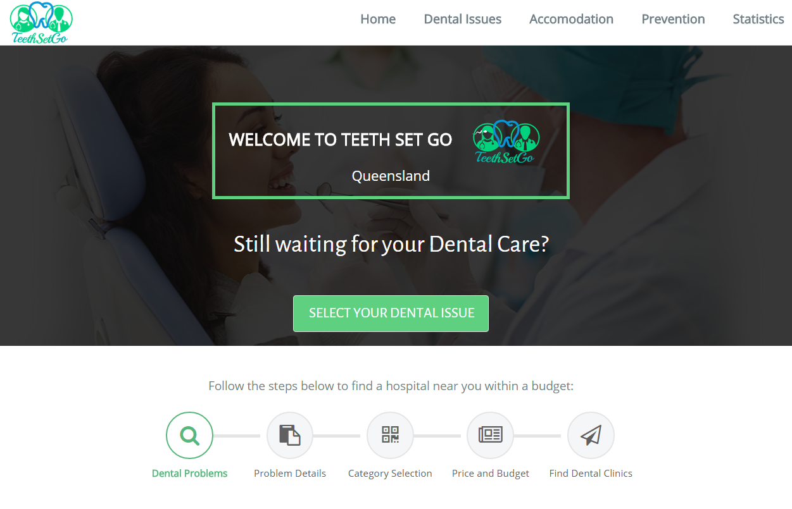
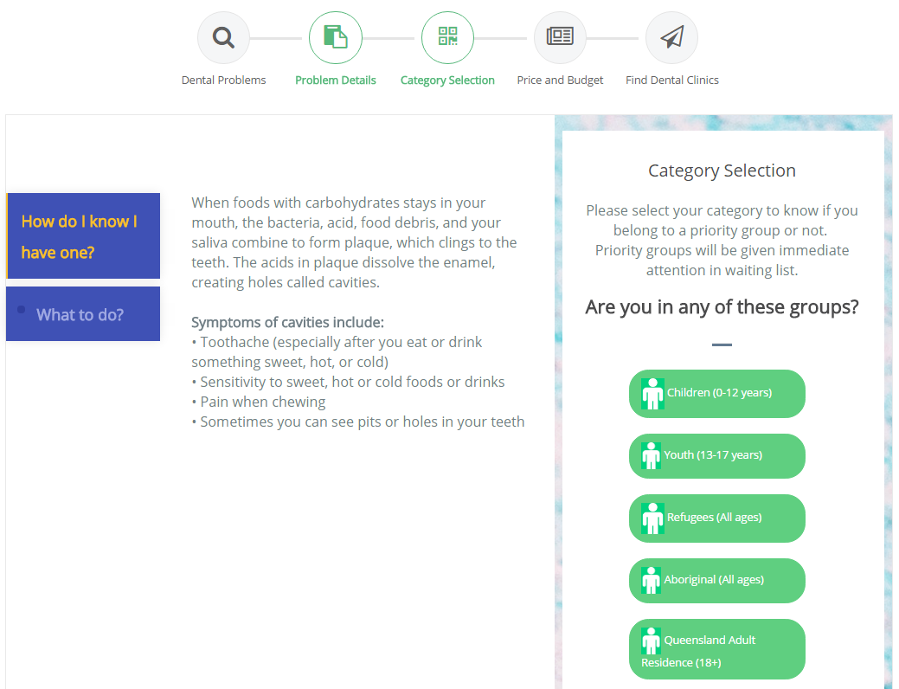
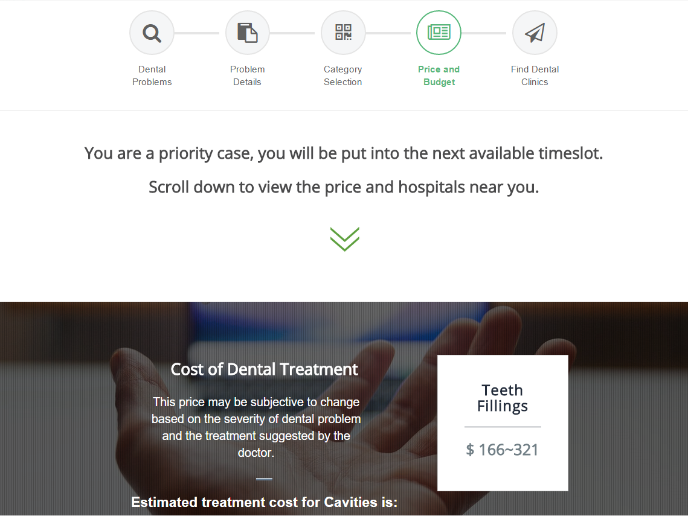
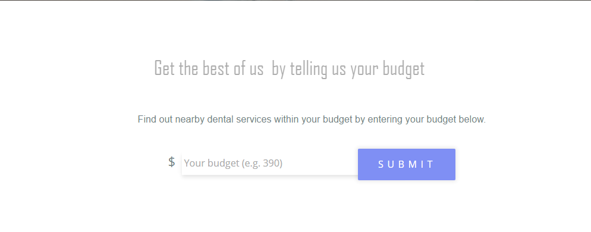

# TeethSetGo
A website providing information of nearby hopitals with least waiting time

Teeth Set Go is for users who are having a dental issue and tring to find relevent information of hospitals, such as waiting time, costs and locations. 
This application is Coded in HTML/CSS/JavaScript, JQuery, ASP.NET, Bootstrap, integrated with Google Map API

Website users can choose the dental problems they have, as follows: 

select their categories,  

cost of recommended treatment would be provided.  

Next, enter their budgets and location, 

then all the hospitals within user selected criteria will be shown on map. Waiting time data of each hospital would be display as well as the total cost.
